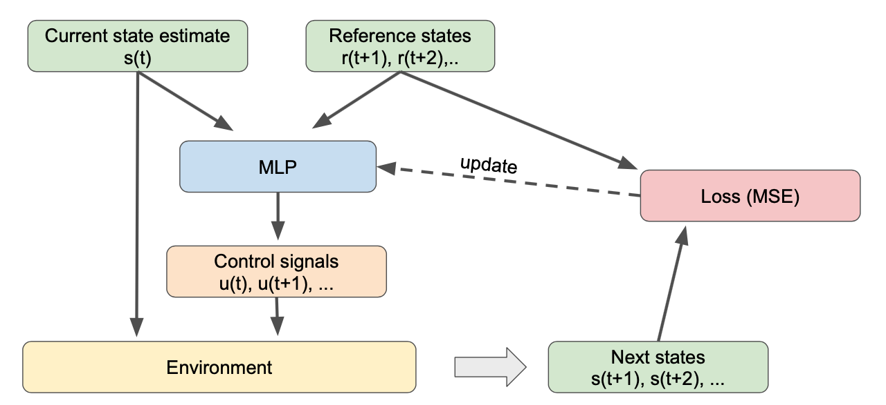

# Weakly supervised flight

In this project we train a autonomous UAV in semi-supervised fashion, only using the tracking error as a loss. The formulation is shown below.



Install all requirements in a virtual environment with 

```
python -m venv env
source env/bin/activate
cd weakly_supervised_flight
pip install -e .
```